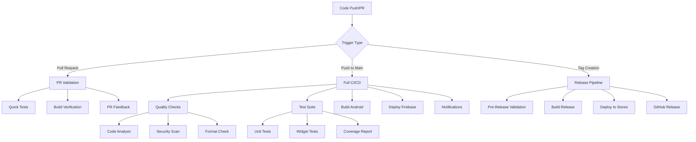

# 🚀 Shoppy CI/CD Pipeline Guide

This guide covers the complete production-level CI/CD pipeline for the Shoppy Flutter e-commerce application.

## 📋 Table of Contents

- [Overview](#-overview)
- [Pipeline Architecture](#-pipeline-architecture)
- [Workflows](#-workflows)
- [Setup Instructions](#-setup-instructions)
- [Security & Secrets](#-security--secrets)
- [Deployment Process](#-deployment-process)
- [Monitoring & Notifications](#-monitoring--notifications)
- [Troubleshooting](#-troubleshooting)

## 🎯 Overview

Our CI/CD pipeline provides:

- **Automated Testing**: Unit, widget, and integration tests
- **Code Quality**: Static analysis, formatting checks, and security scans
- **Multi-Platform Builds**: Android APK/AAB and iOS IPA generation
- **Automated Deployment**: Firebase, Google Play Store, and Apple App Store
- **Security Scanning**: Dependency vulnerabilities and secret detection
- **Real-time Notifications**: Slack and email alerts
- **Comprehensive Monitoring**: Build metrics and performance tracking

## 🏗️ Pipeline Architecture



## 🔄 Workflows

### 1. Main CI/CD Pipeline (`.github/workflows/ci-cd.yml`)

**Triggers**: Push to `main`/`develop`, tags, manual dispatch

**Jobs**:
- 🔍 **Quality Checks**: Code analysis, formatting, security audit
- 🧪 **Test Suite**: Unit tests with coverage reporting
- 🤖 **Android Build**: Debug and release APK/AAB generation
- 🔥 **Firebase Deployment**: Cloud Functions, Firestore rules, storage rules
- 📢 **Notifications**: Slack/email alerts

### 2. Pull Request Validation (`.github/workflows/pr-validation.yml`)

**Triggers**: Pull requests to `main`/`develop`

**Features**:
- Fast feedback (< 10 minutes)
- Quick tests and analysis
- Build verification for Android and Web
- Automatic PR comments with results

### 3. Security Scanning (`.github/workflows/security-scan.yml`)

**Triggers**: Weekly schedule, pushes to `main`, manual dispatch

**Scans**:
- Dependency vulnerabilities
- Secret detection in code
- Firebase security rules validation
- CodeQL security analysis

### 4. Release Pipeline (`.github/workflows/release.yml`)

**Triggers**: Tag creation (`v*`), manual dispatch

**Process**:
- Pre-release validation
- Production builds for Android/iOS
- App store deployment
- GitHub release creation

## 🛠️ Setup Instructions

### Prerequisites

1. **GitHub CLI**: Install from [cli.github.com](https://cli.github.com/)
2. **Firebase CLI**: `npm install -g firebase-tools`
3. **Flutter SDK**: Version 3.16.0 or higher

### Quick Setup

1. **Run the setup script**:
   ```bash
   chmod +x scripts/setup-ci-cd.sh
   ./scripts/setup-ci-cd.sh
   ```

2. **Configure Firebase**:
   ```bash
   firebase login:ci
   # Copy the token and add as FIREBASE_TOKEN secret
   ```

3. **Set up Android signing**:
   ```bash
   # Generate keystore
   keytool -genkey -v -keystore shoppy-release.jks -keyalg RSA -keysize 2048 -validity 10000 -alias shoppy
   
   # Convert to base64
   base64 -i shoppy-release.jks | tr -d '\n'
   # Add as ANDROID_KEYSTORE secret
   ```

4. **Test the pipeline**:
   ```bash
   # Create a test PR
   git checkout -b test-ci-cd
   git commit --allow-empty -m "Test CI/CD pipeline"
   git push origin test-ci-cd
   gh pr create --title "Test CI/CD" --body "Testing the pipeline"
   ```

## 🔐 Security & Secrets

### Required Secrets

| Secret | Description | Example |
|--------|-------------|---------|
| `FIREBASE_TOKEN` | Firebase CI token | `1//xxx` |
| `ANDROID_KEYSTORE` | Base64 encoded keystore | `MIIKXwIBAz...` |
| `ANDROID_KEYSTORE_PASSWORD` | Keystore password | `your-keystore-password` |
| `ANDROID_KEY_PASSWORD` | Key password | `your-key-password` |
| `ANDROID_KEY_ALIAS` | Key alias | `shoppy` |
| `GOOGLE_PLAY_SERVICE_ACCOUNT` | Service account JSON | `{"type": "service_account"...}` |
| `SLACK_WEBHOOK_URL` | Slack webhook | `https://hooks.slack.com/...` |

### Optional Secrets (iOS)

| Secret | Description |
|--------|-------------|
| `APPLE_CERTIFICATE` | Base64 encoded .p12 certificate |
| `APPLE_CERTIFICATE_PASSWORD` | Certificate password |
| `APPLE_PROVISIONING_PROFILE` | Base64 encoded provisioning profile |
| `APP_STORE_CONNECT_API_KEY` | App Store Connect API key |
| `APP_STORE_CONNECT_ISSUER_ID` | Issuer ID |
| `APP_STORE_CONNECT_KEY_ID` | Key ID |

### Security Best Practices

- ✅ All secrets are encrypted in GitHub
- ✅ Secrets are only accessible during workflow runs
- ✅ Regular security scans detect vulnerabilities
- ✅ Firebase rules are validated before deployment
- ✅ Code is scanned for hardcoded secrets

## 🚀 Deployment Process

### Development Flow

1. **Feature Development**:
   ```bash
   git checkout -b feature/new-feature
   # Make changes
   git commit -m "Add new feature"
   git push origin feature/new-feature
   ```

2. **Pull Request**:
   ```bash
   gh pr create --title "Add new feature" --body "Description"
   # PR validation runs automatically
   ```

3. **Merge to Main**:
   ```bash
   # After review and approval
   gh pr merge --squash
   # Full CI/CD pipeline runs
   ```

### Release Process

1. **Create Release Tag**:
   ```bash
   git tag v1.2.3
   git push origin v1.2.3
   # Release pipeline triggers automatically
   ```

2. **Monitor Deployment**:
   - Check GitHub Actions tab
   - Monitor Slack notifications
   - Verify app store submissions

### Rollback Process

1. **Immediate Rollback**:
   ```bash
   # Revert the problematic commit
   git revert <commit-hash>
   git push origin main
   ```

2. **App Store Rollback**:
   - Google Play: Use Play Console to rollback
   - Apple App Store: Submit previous version

## 📊 Monitoring & Notifications

### Slack Notifications

Configured channels:
- `#ci-cd`: Build and deployment status
- `#releases`: Release announcements
- `#security`: Security alerts

### Email Alerts

- **General notifications**: Build failures, deployment status
- **Security alerts**: Critical vulnerabilities, secret detection
- **Release notifications**: Successful app store deployments

### Metrics Dashboard

Monitor in GitHub Actions:
- Build success rate
- Build duration trends
- Test coverage metrics
- Deployment frequency

## 🔧 Troubleshooting

### Common Issues

#### Build Failures

**Issue**: Flutter build fails
```bash
# Solution: Clear Flutter cache
flutter clean
flutter pub get
flutter build apk
```

**Issue**: Android signing fails
```bash
# Solution: Verify keystore secrets
gh secret list
# Check keystore password and alias
```

#### Deployment Issues

**Issue**: Firebase deployment fails
```bash
# Solution: Check Firebase token
firebase login:ci
# Update FIREBASE_TOKEN secret
```

**Issue**: App store deployment fails
```bash
# Solution: Verify certificates and provisioning profiles
# Check App Store Connect API credentials
```

### Debug Commands

```bash
# View workflow runs
gh run list

# View specific run details
gh run view <run-id>

# Download workflow artifacts
gh run download <run-id>

# View workflow logs
gh run view <run-id> --log

# Re-run failed workflow
gh run rerun <run-id>
```

### Environment-Specific Issues

#### Android

- **Gradle issues**: Update Gradle version in `android/gradle/wrapper/gradle-wrapper.properties`
- **NDK issues**: Specify NDK version in `android/app/build.gradle`
- **Signing issues**: Verify keystore format and passwords

#### iOS

- **Certificate issues**: Ensure certificates are valid and not expired
- **Provisioning profile issues**: Verify app identifier matches
- **Xcode version**: Update Xcode version in workflow if needed

#### Firebase

- **Permission issues**: Verify Firebase project access
- **Rules validation**: Test rules locally before deployment
- **Function deployment**: Check Node.js version compatibility

## 📈 Performance Optimization

### Build Optimization

- **Caching**: Flutter dependencies cached between runs
- **Parallel jobs**: Multiple build types run simultaneously
- **Artifact retention**: Configurable retention periods
- **Resource allocation**: Optimized runner types for each job

### Cost Optimization

- **Smart triggers**: Avoid unnecessary builds
- **Timeout limits**: Prevent runaway processes
- **Conditional jobs**: Skip unnecessary steps
- **Artifact cleanup**: Automatic cleanup of old artifacts

## 🎯 Best Practices

### Code Quality

- ✅ Always run tests before merging
- ✅ Maintain high test coverage (>80%)
- ✅ Follow Flutter/Dart style guidelines
- ✅ Regular dependency updates

### Security

- ✅ Regular security scans
- ✅ Rotate secrets periodically
- ✅ Review dependency vulnerabilities
- ✅ Validate Firebase rules

### Deployment

- ✅ Gradual rollouts for major releases
- ✅ Monitor app performance post-deployment
- ✅ Maintain release notes
- ✅ Test in staging before production

## 🔗 Useful Links

- [GitHub Actions Documentation](https://docs.github.com/en/actions)
- [Flutter CI/CD Best Practices](https://docs.flutter.dev/deployment/ci)
- [Firebase CLI Reference](https://firebase.google.com/docs/cli)
- [Google Play Console API](https://developers.google.com/android-publisher)
- [App Store Connect API](https://developer.apple.com/documentation/appstoreconnectapi)

---

## 📞 Support

For CI/CD pipeline issues:
1. Check this documentation
2. Review GitHub Actions logs
3. Check Slack `#ci-cd` channel
4. Contact the DevOps team

**Happy deploying! 🚀** 